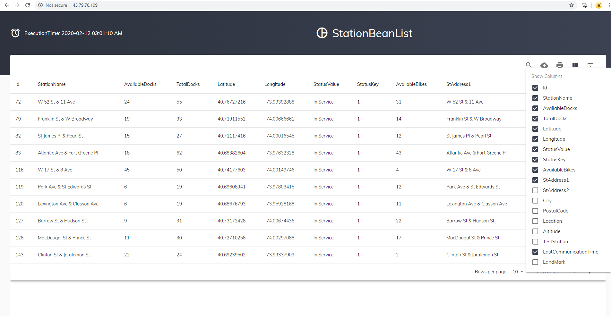
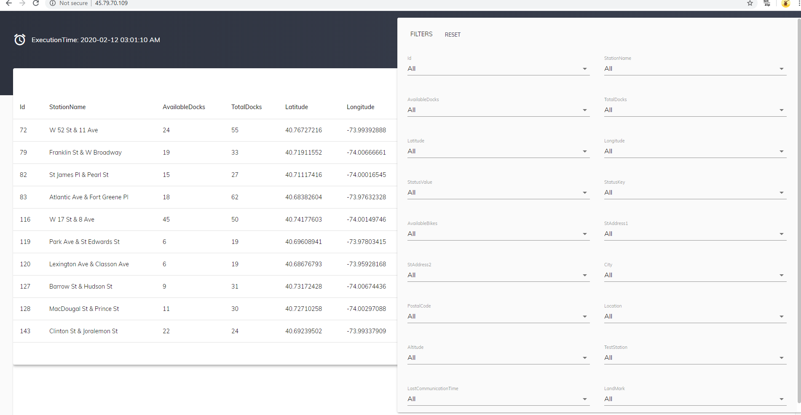
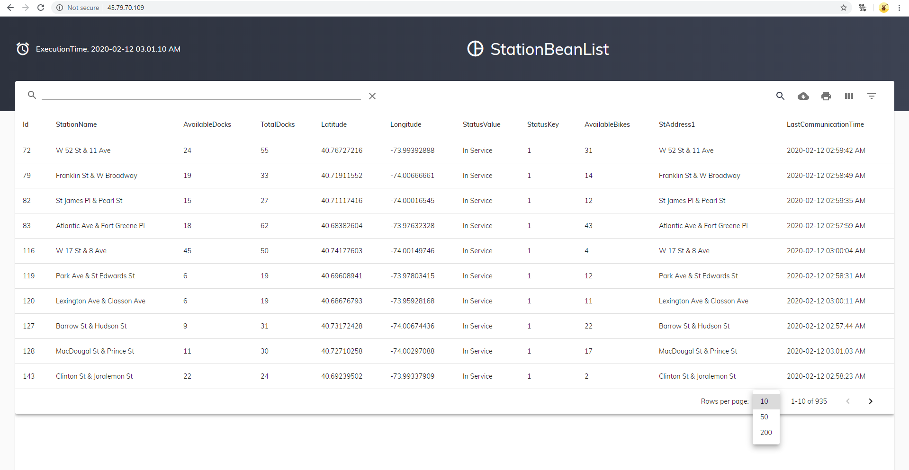

# React datatable

## Introduction
This is a sample of datatable which has many features including filter,search,print and so on.

It uses data from backend api which doesn't support to CORS.

To overcome CORS error, system has its own backend and use this backend to retrive data.

This was developed with React.

## System Screenshot

